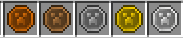

Coins
=====

Patchwork adds 5 different coins: Copper, Bronze, Silver, Gold, and Platinum.  The coins can be
obtained as drops by killing mobs, or by finding in chests in villages, dungeons, strongholds, etc.

The coins can be used as barter when interacting with other players, or used with Shop Shelves to
conduct a trade.

Coins can be combined to create a coin of the next larger denomination: 9 Copper to make a Bronze,
9 Bronze to make a Silver, 9 Silver to make a Gold, and 9 Gold to make a Platinum.

For server owners Coins can be handed out as rewards for things like voting, and can be used to
purchase items at Server Shops.  For modpack makers coins could be handed out as quest rewards, and
used as items to satisfy quests.

Configuration
^^^^^^^^^^^^^

- **coins.mobsDropCoins** Enable/disable coins as mob drops when a player kills a mob.  Mobs do not drop coins if killed by other means (fall traps, machines, etc.)
- **coins.spawnAsLoot** Enable/disable coins in the various loot tables.
- **items.enableCoins** Enable/disable coin recipes.
