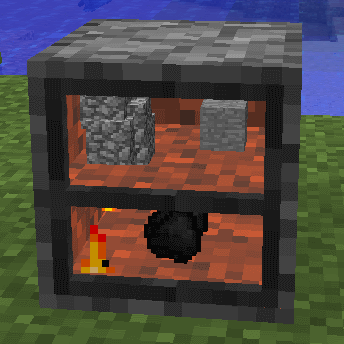

3D Furnace
==========

The 3D furnace behaves in a way very similar to the regular Minecraft furnace.  The big difference
between the two furnaces is that the 3D version shows the content of the furnace without having to
open up the furnace GUI.

The other main feature of the 3D furnace is that the player can interact with it in a natural way:

- Right clicking the block will remove any smelted material from the furnace, collecting any XP that has been generated.
- Right clicking while holding furnace fuel will put it in the fuel slot assuming the current fuel ItemStack is compatible.
- Right clicking with other ingredients will add them to the input slot assuming the current input ItemStack is compatible.
- Shift+Right click will open the GUI without the interaction behavior.

While operating the furnace interior will glow, and the furnace itself will give off light at level
7.  It will flame and smoke while it is lit.  Once smelting has completed the light will turn off and
the furnace will no longer glow.