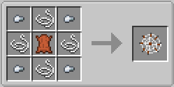

Mob Net
-------

The Mob Net is an item that allows the capture and transport of entities in the world.  By default
only passive mobs can be captured, but options can be enabled to permit the capture of Villagers
and hostile mobs.

To capture a mob the player has to be in range.  Right click the mob with an empty net will capture.
To release the mob target an empty block face and right click.

When captured the title of the Mob Net will change to reflect the mob that has been captured.

Mob Net's are not stackable.

Configuration
^^^^^^^^^^^^^
- **items.enableMobnet** Enable/disable crafting of the Mob Net
- **mobnet.enableHostileCapture** Enables/disables capture of hostile mobs, like Zombies and Creepers.
- **mobnet.enableVillagerCapture** Enables/disables capture of Villagers.
- **mobnet.reusable** Enables/disables reuse of a Mob Net.  If disabled the Mob Net will disappear once the mob has been released.
