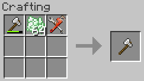

Repair Paste
------------

Repair paste is used to repair damaged items.  It can be found randomly in village blacksmith
chests as well as various dungeon chests throughout the world.  It cannot be crafted by the player.

To repair a damaged item combine the item with Repair Paste and a Set of Tools in a crafting grid.
Each paste will repair up to 100 points of damage.  If a stack or more of Repair Paste is provided
the crafting operation will deduct an amount needed to fully repair the item.  The Set of Tools
will be damaged based on the amount repaired.

It is recommended that the traditional method of Anvil repair should be used as long as possible
to repair an item.  When the cost of Anvil repair becomes prohibitive, Repair Paste should be used.

Configuration
^^^^^^^^^^^^^

- **items.enableToolRepair** Enable/disable the ability to repair tools with Repair Paste.
- **repairpaste.repairAmount** Amount of damage to repair per paste.
 