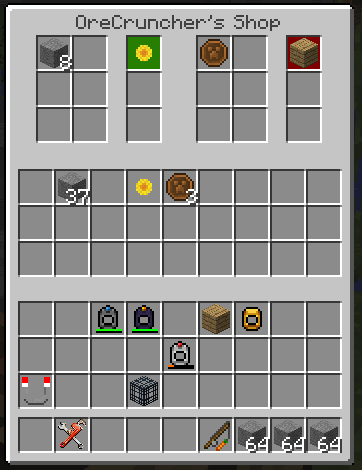
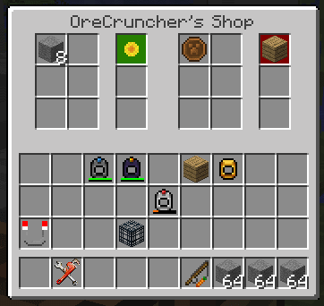

Shop Shelf
==========
..	list-table::
	:widths: 40 40
	:header-rows: 0
	
	*	- .. 	image:: images/shopshelf_wood.png
		- .. 	image:: images/shopshelf_stone.png

The Shop Shelf is a special block that allows for trading between players on a server.  Operationally
it is like the Vending Machine block from my old 1.7.10 mod Thermal Recycling.

When the Shop Shelf is initially placed into the world it is unowned.  The first player to open the
Shop Shelf will become the owner.

As an owner you can do several things:

- The Shop Shelf can be reskinned to a different texture.  To do this just right click with a block and it will take on that texture.  As shown in the two pictures above the one on the right has been reskinned with the stone texture.
- The Shop Shelf can be opened in trade mode by Shift+Right click.  This is the GUI that non-owners will see when opening the Shop Shelf.
- The Shop Shelf can be opened in configuration mode by a simple right click.
- It can be broken with an axe, and it will drop with all it's inventory stored in the ItemStack.

The owner can configure up to 6 different trades.  Each trade can accept up to 2 input ItemStacks,
and offer ItemStack that the player would receive in return.

In the picture above the Shop Shelf is identified as belonging to OreCruncher.  The top grouping of
slots are for trade, the center grouping of slots is the internal inventory of the Shop Shelf, and
the bottom group of slots is the player inventory.

As you can see there are two configured trades: one that wants 8 stone and in return it will give a
Sunflower, and the other that wants a Copper Coin and offers an Oak Plank in return.  The Sunflower
has a background of green meaning that there is enough Sunflower items in the Shop Shelf inventory to
satisfy the trade.  However, there are not enough Oak Planks so it's background is shaded red.

A non-owner is capable of opening up the Shop Shelf and performing trades.

	

Configuring Trades
^^^^^^^^^^^^^^^^^^
Configuration is pretty straight forward. The trade slots are ghost slots. Clicking on them with an
item stack will set the slot to that item type and quantity. When the mouse cursor is over a slot
several other short cuts methods for manipulating the slot content are available:

- Wheel on the mouse. This will cause the quantity to go up/down depending on the direction the wheel is scrolled.
- Left Click. Reduce the stack by one.
- Shift+Left Click. Reduce the stack by half.
- Right Click. Increment the stack by one.
- Shift+Right Click. Double the stack size.

The region below the configuration slots is the Vending Machines inventory. Items that are to be
handed out are placed into this inventory. Items that a player gives in return are also placed into
this inventory. Make sure you leave empty space to hold incoming trade items. If there isn't space
a trade will not happen.

Trading Items
^^^^^^^^^^^^^
Trading is pretty easy. Just click on the item stack that is being offered for trade. The item(s)
that are wanted in exchange are automatically taken from the player inventory and added to the
Shop Shelf inventory. The offered item will automatically be placed directly into the player
inventory.

A trade could fail for several different reasons:

- The Shop Shelf ran out of a particular item to give out.
- The Shop Shelf does not have space in it's inventory to accept items in return.
- The player does not have space in their inventory to get the item.
- The player does not have the right items to give in exchange.

Server Shop Shelf
^^^^^^^^^^^^^^^^^
A Server Shop Shelf essentially has a bottomless inventory. It has infinite amount of items to hand
out, and can accept an infinite amount of items in return. The operation is similar to Admin signs
that are found on Bukkit servers.

..	note::

	Currently it is not possible to setup a Server Shop Shelf.  This feature will be arriving soon. :)

Notes
^^^^^
- While the shop is owned it cannot be broken by another regular player, and it cannot be blown up with creepers or TNT.  I'm not sure if it would survive a Draconic Evolution reactor explosion.
- Automation is not possible with the Shop Shelf.  Items cannot be piped in or extract using transfer pipes, hoppers, and similar devices.
- Any player that is in creative mode can interact with the Shop Shelf as if they were the owner.  This is to permit Administrators on servers latitude to administer their servers.
