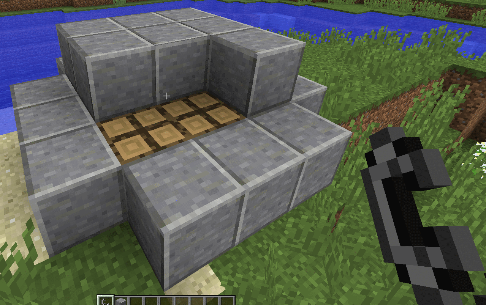

Wood Pile
---------

   
A Wood Pile is a simple multi-block structure which is used to make charcoal.  The process is 
pretty easy:

- **STEP 1** Craft a bunch of Wood Pile blocks.
- **STEP 2** Place the Wood Pile blocks adjacent to each other.  Number of layers does not really matter.
- **STEP 3** Cover up the pile using non-flammable solid blocks, like Dirt or Cobblestone.  Leave one block surface exposed.
- **STEP 4** Light the exposed surface on fire.  A good method is Flint and Steel.  Once the fire has started, cover up the block.  (This will put the fire out but the Wood Pile is actively burning.)

Let the Wood Pile burn.  While burning smoke particles will be emitted and a burning sound will be
heard.  When the Wood Pile first starts burning the smoke particles are rather large and the fire
sound will be loud and crackly.  The closer it gets to being finished the smaller the smoke
particles become and the burning sound more mute.

Once all signs of burning have ceased uncover the pile to expose the Ash Blocks underneath.  Break
the Ash Blocks with an Axe to drop charcoal.  The amount of charcoal dropped per block is 8, and is
affected by Fortune.

If you uncover the Wood Pile too soon the exposed burning Wood Pile will quickly turn to a fire.
You will need to fill the gap with a solid non-flammable block to seal the pile back up.

..	note::
	If the Wood Pile has multiple levels the smoke particles from the lower levels may not be seen.
	Make sure you give a good listen to hear if the burning has stopped before uncovering the Wood
	Pile.

If you don't use non-flammable solid blocks fire will spread.  This will destroy any other Wood
Pile blocks adjacent, and of course it could spread to the rest of the area.  Only you can prevent
forest fires.

Configuration
^^^^^^^^^^^^^
- ``items.enableWoodPile`` Enable/disable the Wood Pile recipe.
- ``ashblock.yield`` The amount of charcoal that is dropped when an Ash Block is broken.
- ``woodpile.tickRate`` The number of ticks between stage checks.  The Wood Pile has 8 burning stages.